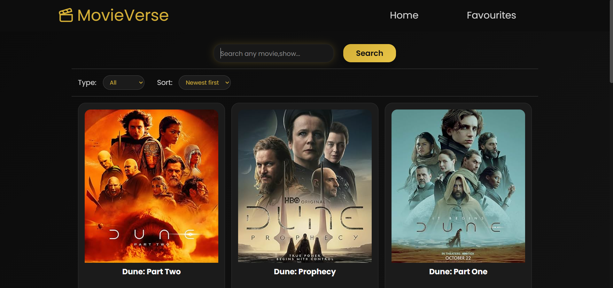
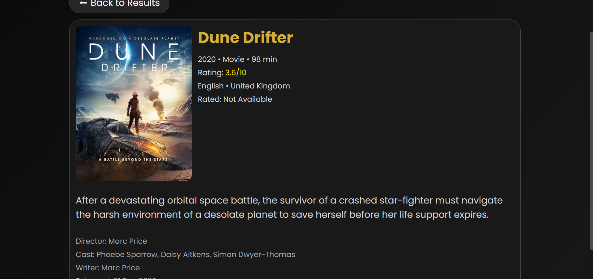
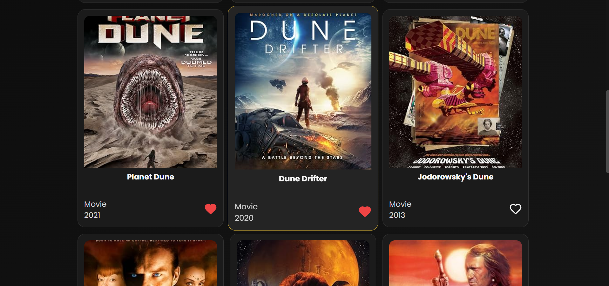
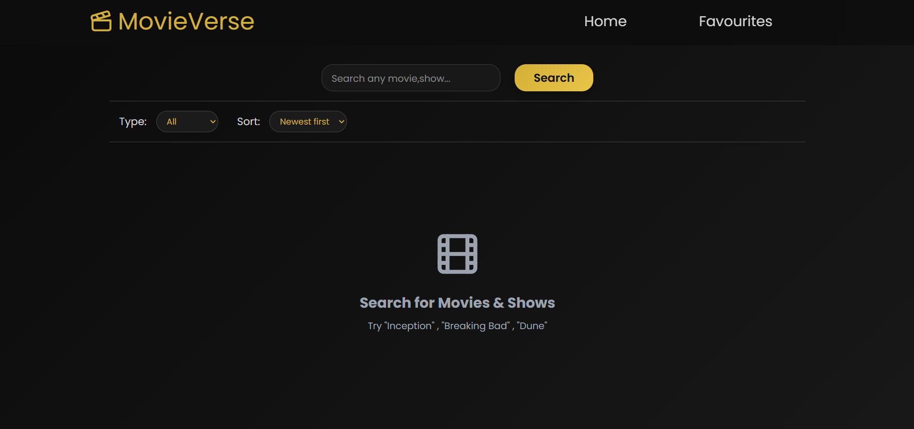

# 🎬 MovieVerse

MovieVerse is a responsive movie and TV show search application built with **React** that lets users search thousands of movies and series using the **OMDb API**. Users can browse search results, filter and sort movies, view detailed information about each title, and save their favorite movies locally.

Designed with a modern dark cinematic UI, MovieVerse focuses on providing a smooth user experience with responsive layouts, loading states, empty states, and persistent favorites.

---

## 🌐 Live Demo

**Live Website:** *(link here)*

---

## 📸 Preview

<!--* Home Page


* Search Results


* Movie Details


* Favorites
-->


| Home                            | Movie Details                         |
| ------------------------------- | ------------------------------------- |
|  |  |

| Favourites                                  | Empty State                       |
| ------------------------------------------- | --------------------------------- |
|  |  |


---

# ✨ Features

### 🔍 Movie Search

* Search movies, TV series, and episodes.
* Debounced search (500ms delay) to reduce unnecessary API calls.
* Manual search using the Search button or Enter key.
* Handles invalid searches gracefully.

### 🎞 Movie Grid

* Responsive movie cards.
* Displays:

  * Poster
  * Title
  * Type
  * Release Year
* Placeholder displayed when no poster is available.

### ❤️ Favorites

* Add or remove favorites instantly.
* Favorite status indicated with a heart icon.
* Favorites are stored in **localStorage**, so they remain after refreshing the page.

### 🎬 Movie Details

Clicking a movie opens a dedicated details page containing:

* Poster
* Title
* Year
* Type
* Runtime
* IMDb Rating
* Language
* Country
* Plot
* Director
* Writer
* Cast
* Release Date
* Awards

Missing information is replaced with **"Not Available"** where appropriate.

### 🔎 Filter & Sort

Filter by:

* All
* Movie
* Series
* Episode

Sort results by:

* Newest First
* Oldest First
* A → Z
* Z → A

### ⚡ Loading State

A centered animated loader is displayed while data is being fetched.

### 📭 Empty States

Custom empty states are shown for:

* Initial application
* No search results
* Empty favorites

### ⚠ Error Handling

Gracefully handles:

* Invalid searches
* API errors
* Missing movie details
* Missing posters
* Network failures

---

### 📱 Responsive Design

Optimized for:

* Desktop
* Laptop
* Tablet
* Mobile

The layout adapts automatically using CSS Grid, Flexbox, and media queries.

---

# 🛠 Tech Stack

* React
* JavaScript (ES6+)
* CSS3
* HTML5
* Vite
* OMDb API
* Lucide React Icons

---

# 📂 Project Structure

```text
src/
│
├── components/
│   ├── EmptyState.jsx
│   ├── FilterSortBar.jsx
│   ├── Loader.jsx
│   ├── MovieCard.jsx
│   ├── MovieGrid.jsx
│   ├── NavBar.jsx
│   └── SearchBar.jsx
│
├── pages/
│   ├── Home.jsx
│   ├── Favourites.jsx
│   └── MovieDetails.jsx
│
├── App.jsx
├── main.jsx
└── index.css
```

---

# 🚀 Getting Started

## Clone the repository

```bash
git clone https://github.com/codewithyashsoni/MovieVerse.git
```

Move into the project folder:

```bash
cd MovieVerse
```

Install dependencies:

```bash
npm install
```

Create a `.env` file in the project root:

```env
VITE_OMDB_API_KEY=YOUR_API_KEY
```

Start the development server:

```bash
npm run dev
```

---

# 🔑 Environment Variables

```env
VITE_OMDB_API_KEY=YOUR_API_KEY
```

Get a free API key from the OMDb API website.

---

# 💡 Implementation Highlights

* React Hooks (`useState`, `useEffect`)
* Component-based architecture
* Debounced searching
* Conditional rendering
* Dynamic filtering
* Dynamic sorting
* LocalStorage persistence
* Responsive CSS
* Reusable UI components
* Error handling
* Empty state handling
* Loading state handling
* Keyboard accessibility for movie cards

---

# 🎨 UI Highlights

* Dark cinema-inspired theme
* Gold accent color palette
* Responsive movie cards
* Hover animations
* Animated loading spinner
* Smooth transitions
* Consistent spacing
* Accessible typography

---

# 📈 Future Improvements

* Infinite scrolling
* Pagination
* Movie trailers
* Cast profile pages
* Similar movie recommendations
* Search history
* Theme switcher
* Advanced filtering (IMDb Rating, Genre, Year)
* Recently viewed movies

---

# 📚 What I Learned

While building MovieVerse, I gained hands-on experience with:

* Fetching data from REST APIs
* Managing application state with React Hooks
* Conditional rendering
* Building reusable React components
* Responsive UI design
* LocalStorage
* Error and loading management
* Debouncing user input
* Component communication using props
* Clean project organization

---

# 📜 License

This project is open-source and available under the **MIT License**.